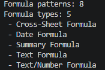

# Smartsheet Formula Helper

A small Python project that turns a structured CSV of Smartsheet formula examples into a clean Markdown reference guide.

This project is part of my AI portfolio focused on project controls, workflow automation, and practical business-facing tools.

## Business Problem

Project teams often rely on Smartsheet formulas for schedule tracking, risk logs, reports, dashboards, and cross-sheet workflows.

These formulas can be difficult to maintain because of:

- Column name syntax
- Nested IF logic
- Date calculations
- Cross-sheet references
- Checkbox logic
- Report sorting issues
- Reusable project controls patterns

The goal of this project is to organize common Smartsheet formula patterns into a reusable reference guide.

## What This Tool Does

The script reads formula examples from `data/formula_requests.csv`.

It validates the required columns, groups formulas by formula type, and generates `output/formula_reference.md`.

The generated reference includes:

- Formula type
- Use case
- Plain-English business rule
- Required Smartsheet columns
- Example formula
- Notes about how or when to use the formula

## Current Formula Categories

The starter data includes examples for:

- Cross-sheet formulas
- Date formulas
- Summary formulas
- Text formulas
- Text/number formulas

## Example Use Cases

Current examples include:

- Milestone ID Builder
- Schedule Moved in Workdays
- RIO Checkbox Logic
- RIO ID Lookup
- Kickoff Total Count
- Kickoff Complete Count
- Property Name Shortener
- Month Sort Helper

## Project Structure

- `data/formula_requests.csv` stores the formula examples
- `output/formula_reference.md` is the generated reference guide
- `src/build_formula_reference.py` contains the Python script
- `tests/test_build_formula_reference.py` is reserved for tests
- `README.md` explains the project

## How to Run

From the project folder, activate the virtual environment:

`.\.venv\Scripts\Activate.ps1`

Then run:

`python src\build_formula_reference.py`

The script will generate or update `output/formula_reference.md`.

## Example Console Output

Formula reference generated successfully.

Formula patterns: 8

Formula types: 5

- Cross-Sheet Formula
- Date Formula
- Summary Formula
- Text Formula
- Text/Number Formula

## Screenshot

Example terminal output after generating the Smartsheet formula reference guide:

## Why This Matters

This project demonstrates how a project controls professional can use AI-assisted development to turn repeated business logic into reusable workflow documentation.

Instead of treating formulas as one-off fixes, this tool organizes them into a structured reference library that can support future automation, training, QA, and standardization.

## AI Workflow

ChatGPT was used to help:

- Define the project concept
- Design the folder structure
- Create the starter CSV
- Write the first Python script
- Explain each step in a beginner-friendly way
- Guide Git and GitHub setup

Codex will be used later in a controlled review-first workflow for small improvements.

## Future Improvements

Potential future enhancements include:

- Add tests for CSV validation and Markdown generation
- Add formula syntax risk notes
- Add formula categories by workflow type
- Add a plain-English formula request input
- Suggest formula templates based on use case
- Create a simple web interface
- Add screenshots or example output images

## Portfolio Context

This is Project #2 in an AI portfolio focused on practical project controls automation.

Project #1: Schedule Movement Analyzer

Project #2: Smartsheet Formula Helper

## How to Run Tests

This project uses Python's built-in `unittest` module.

From the project folder, run:

`python -m unittest discover -s tests`

Expected output:

`Ran 4 tests`

`OK`
